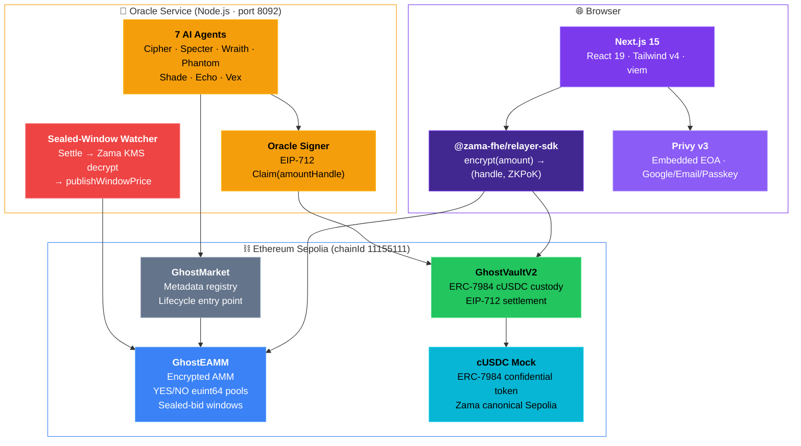
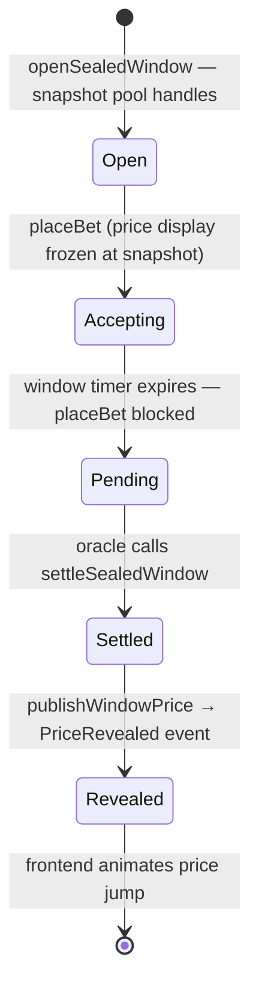

<!-- Header -->
<p align="center">
  
</p>

<p align="center">
  
  
  
  
</p>

<h1 align="center">GhostMarket</h1>

<p align="center">
  <strong>Confidential Dark Pool Prediction Market</strong><br/>
  Every deposit, every bet, every payout — a ciphertext from browser to blockchain.<br/>
  <em>The chain knows you bet. It does not know on what, in what size, or for how much.</em>
</p>

<p align="center">
  <a href="#-what-it-is"></a>&nbsp;
  <a href="#-architecture"></a>&nbsp;
  <a href="#-privacy-model"></a>&nbsp;
  <a href="#-encrypted-stack"></a>&nbsp;
  <a href="#-oracle-agent-quorum"></a>&nbsp;
  <a href="#-deployed-contracts"></a>&nbsp;
  <a href="#-running-locally"></a>
</p>

---

## Table of Contents

- [What It Is](#-what-it-is)
  - [Problems Solved](#problems-solved)
- [Architecture](#-architecture)
- [Privacy Model](#-privacy-model)
- [Encrypted Stack](#-encrypted-stack)
  - [1. ERC-7984 Confidential Vault](#1-erc-7984-confidential-vault)
  - [2. Encrypted AMM](#2-encrypted-amm)
  - [3. Sealed-Bid Windows](#3-sealed-bid-windows)
  - [4. Confidential Settlement](#4-confidential-settlement)
- [Oracle Agent Quorum](#-oracle-agent-quorum)
- [User Journey](#-user-journey)
- [Deployed Contracts](#-deployed-contracts)
- [Repository Layout](#-repository-layout)
- [Running Locally](#-running-locally)
- [Tests](#-tests)
- [Operational Notes](#-operational-notes)

<p align="center">
  
</p>

---

## 👻 What It Is

GhostMarket is a binary prediction market where **no financial value ever exists as plaintext on-chain.** Not deposits. Not pool totals. Not bet sizes. Not payouts. Every value is an `euint64` ciphertext processed by the [Zama FHEVM](https://docs.zama.ai/fhevm) coprocessor on Ethereum Sepolia.

The ERC-7984 cUSDC token holding all collateral literally cannot answer the question "how much does this user own?" The oracle signs over an *encrypted handle*, not a `uint256`. Two users can place bets in the same window and neither can infer the other's size from a price delta, because the price is frozen until the window closes.

Combined with a **sealed-bid window** mechanism, a **7-agent AI oracle quorum** grounded in live exchange feeds, and **Privy walletless login**, this is what Polymarket would look like if the chain refused to publish your size.

### Problems Solved

| Problem | Solution | Mechanism |
|:--------|:---------|:----------|
|  | FHE encryption of every value | `euint64` ciphertexts in calldata, storage, events, and settlements |
|  | Cryptographic ACL — no master key | Zama KMS re-encryption; nobody can read another user's position |
|  | Sealed-bid windows | Pool ACL withheld during window; all bets revealed atomically |
|  | 7-agent AI quorum | Each agent fetches a live CEX API, reasons via gpt-4o-mini, votes independently |
|  | Settlement over encrypted handle | Oracle signs `keccak(user, marketId, amountHandle, nonce, expiry)` |
|  | ERC-7984 cUSDC custody | All balances and locks are `euint64` in `GhostVaultV2` |
|  | Privy embedded wallets | Google / email / passkey login — no mnemonic, no extension |

---

## 🏗 Architecture



### End-to-End Payout Flow

```mermaid
graph LR
    A["👤 User encrypts<br/>amount in browser"] --> B["🔒 cUSDC.setOperator<br/>+ GhostVaultV2.deposit"]
    B --> C["🏦 euint64 balance<br/>in vault"]
    C --> D["🎯 lockForBet +<br/>placeBet (FHE.add)"]
    D --> E["🪟 Sealed window<br/>pool frozen"]
    E --> F["⏰ Window expires<br/>→ PriceRevealed"]
    F --> G["🤖 Oracle quorum<br/>resolveMarket on-chain"]
    G --> H["✍️ Oracle signs<br/>Claim(amountHandle)"]
    H --> I["💸 confidentialTransfer<br/>(user, amountHandle)"]

    style A fill:#f8fafc,stroke:#334155,color:#000
    style B fill:#412891,stroke:#7c3aed,color:#fff
    style C fill:#22c55e,stroke:#4ade80,color:#000
    style D fill:#3b82f6,stroke:#60a5fa,color:#fff
    style E fill:#06b6d4,stroke:#22d3ee,color:#000
    style F fill:#06b6d4,stroke:#22d3ee,color:#000
    style G fill:#f59e0b,stroke:#fbbf24,color:#000
    style H fill:#f59e0b,stroke:#fbbf24,color:#000
    style I fill:#22c55e,stroke:#4ade80,color:#000
```



---

## 🔐 Privacy Model

<p>
  
  
  
</p>

| On-chain — anyone can read | FHE-encrypted (`euint64` ciphertext handle only) |
|:---------------------------|:-------------------------------------------------|
| Market ID, title, category, expiry | Vault deposit amount |
| User EOA address | Vault balance per user |
| Bet side (YES / NO) | Per-market collateral lock |
| Market status, resolved outcome | Total locked per user |
| Sealed-window timestamps | YES pool total · NO pool total |
| Tx hashes, block numbers | Per-user YES position · NO position |
| | Pre-window pool snapshot |
| | Payout amount handle |

**Every on-chain event has zero amount fields — by design:**

```solidity
event BetPlaced    (uint256 indexed marketId, address indexed user, bool indexed side);
event Deposited    (address indexed user);
event BetLocked    (address indexed user, bytes32 indexed marketId, bool side);
event PayoutClaimed(address indexed user, bytes32 indexed marketId);
```

**ACL — who can decrypt what:**

| Role | Can read | Mechanism |
|:-----|:---------|:----------|
| -8B5CF6?style=flat-square) | Own balance, own lock, own position | `FHE.allow(handle, msg.sender)` on every write |
|  | Its own ciphertexts (for re-use in arithmetic) | `FHE.allowThis(handle)` |
|  | Pool totals — only after resolution or window settlement | `FHE.allow(pool, resolver)` in `resolveMarket` / `settleSealedWindow` |
|  | Nothing, ever | No ACL entry is written for third parties |

> **Privacy is trader-private, not authority-private.** A regulator can be issued an ACL grant to specific handles via contract upgrade — the cryptography supports selective disclosure. This is the same shape as institutional dark pools in TradFi.

---

## 🔬 Encrypted Stack

### 1. ERC-7984 Confidential Vault

<p>
  
  
</p>

| Layer | Sepolia Address | Role |
|:------|:----------------|:-----|
|  Underlying (ERC-20, mintable) | [`0x9b5C…dFfF`](https://sepolia.etherscan.io/address/0x9b5Cd13b8eFbB58Dc25A05CF411D8056058aDFfF) | Faucet token — mint, then wrap |
|  ERC-7984 confidential wrapper | [`0x7c5B…3639`](https://sepolia.etherscan.io/address/0x7c5BF43B851c1dff1a4feE8dB225b87f2C223639) | What users actually deposit |

`deposit` — the key insight: the vault never holds a plaintext amount at any step.

```
user: setOperator(vault, forever)              ← encrypted-token "approve"
user: encrypt(amount) → (handle, ZKPoK)        ← plaintext gone in browser
GhostVaultV2.deposit(handle, proof):
  FHE.fromExternal(handle, proof)              ← verify ZKPoK
  FHE.allow(amount, address(cUSDC))            ← let cUSDC use this handle
  cUSDC.confidentialTransferFrom(user, vault)  ← homomorphic debit, no plaintext
  _balances[user] = FHE.add(_balances[user], transferred)
```

Overdraw can't be a `revert` — the EVM never sees a plaintext comparison. Instead:

```solidity
ebool   ok              = FHE.ge(freeBalance, amount);
euint64 effectiveAmount = FHE.select(ok, amount, FHE.asEuint64(0));  // clamp in coprocessor
```

### 2. Encrypted AMM

`GhostEAMM` pool totals accumulate via `FHE.add`. No party has ACL access until market resolution or sealed-window settlement.

The minimum-bet guard runs entirely inside the coprocessor — the EVM never sees whether the submitted amount passed:

```solidity
ebool   aboveMin        = FHE.gt(amount, FHE.asEuint64(MIN_BET_UNITS));
euint64 effectiveAmount = FHE.select(aboveMin, amount, FHE.asEuint64(0));
```

Per-user positions are ACL-scoped to the owner on every write:

```solidity
_yesPositions[marketId][msg.sender] = FHE.add(..., effectiveAmount);
FHE.allowThis(_yesPositions[marketId][msg.sender]);
FHE.allow    (_yesPositions[marketId][msg.sender], msg.sender);  // user decrypts own position
```

After resolution the oracle gets one-shot ACL on *only the winning side* of *one specific user* via `grantPositionAccess`.

### 3. Sealed-Bid Windows

Even with encrypted bets, a continuously visible price is a side-channel: a tiny probe bet + the resulting price delta reveals the previous bet's size. Sealed windows close this.



> **Commit-reveal without a second user transaction.** The clock is the reveal; the bets were real the whole time; nobody owes a second tx. The combined delta publishes as one `PriceRevealed` event — no participant can chart anyone else's order flow inside the window.

### 4. Confidential Settlement

After oracle quorum the oracle signs over the **encrypted ciphertext handle**, not a plaintext amount:

```solidity
// GhostVaultV2 — CLAIM_TYPEHASH
"Claim(address user, bytes32 marketId, bytes32 amountHandle, uint256 nonce, uint256 expiry)"
//                                      ^^^^^^^^^^^^^^^^^^^
//                                      euint64 handle — not a uint256 amount
```

The vault verifies the signature and calls `cUSDC.confidentialTransfer(user, amountHandle)`. The handle flows through homomorphically.

**The plaintext payout exists only in the user's browser** when they decrypt their own balance handle. It never appears in: oracle memory, vault storage, token storage, calldata, events, or any block explorer.

Replay protection: `usedNonces[user][marketId][nonce]`. Settlement TTL: 24 hours. Signer rotation: `setSettlementSigner(newOracle)`.

---

## 🤖 Oracle Agent Quorum

<p>
  
  
  
  
</p>

| Agent | Source | Personality |
|:------|:-------|:------------|
|  | Binance | Data-driven; only trusts top-tier CEX feeds |
|  | CoinGecko | Cautious; high threshold before voting YES |
|  | Chainlink / CryptoCompare | On-chain feeds preferred over off-chain |
|  | Coinbase | Contrarian; stress-tests the consensus |
|  | Kraken | Cross-reference consensus-seeker |
|  | OKX | Volume-weighted aggregator |
|  | Bybit | Adversarial; hunts manipulation and stale data |

Each agent: `fetching` (live API call, 6s timeout) → `attesting` (personality-specific gpt-4o-mini prompt with the real fetched value, JSON-only `{vote, reasoning}`) → `submitted`. On quorum: `resolveMarket` on Sepolia, settlement endpoint opens.

The **Oracle Room** (`/oracle`, ~1250 LOC) streams every agent's state, fetched price, live LLM reasoning, and on-chain tx hash via WebSocket. Every reasoning line is a real LLM response grounded in a real API call — nothing is pre-canned.

---

## 🧭 User Journey

| Phase | Action | What happens on-chain |
|:------|:-------|:----------------------|
|  | Browse `/`, click a market | Reads public metadata + post-window `PriceRevealed` events |
|  | Click YES/NO → Google sign-in | Privy creates embedded EOA — no mnemonic |
|  | `/vault` → mint → wrap → setOperator → deposit | `confidentialTransferFrom`; vault balance becomes `euint64` |
|  | Enter amount, click Place Bet (one click) | `lockForBet` + `placeBet` — `BetPlaced` event has no amount |
|  | Watch `SealedCountdown` → timer hits zero | Oracle settles window, KMS decrypts pools, `PriceRevealed` emitted |
|  | `/oracle` → Resolve → watch agents stream live | `resolveMarket` tx appears on Sepolia in real time |
|  | `/portfolio` → Claim | Oracle signs `Claim(amountHandle)`; vault calls `confidentialTransfer(user, handle)` |

---

## 📦 Deployed Contracts

<p>
  
  
  
</p>

| Contract | Address | Role |
|:---------|:--------|:-----|
|  | [`0x9b5C…dFfF`](https://sepolia.etherscan.io/address/0x9b5Cd13b8eFbB58Dc25A05CF411D8056058aDFfF) | Underlying ERC-20, public mint |
|  | [`0x7c5B…3639`](https://sepolia.etherscan.io/address/0x7c5BF43B851c1dff1a4feE8dB225b87f2C223639) | ERC-7984 confidential wrapper |
|  | [`0xab75…0F5E`](https://sepolia.etherscan.io/address/0xab7562Cfb1C57aF0975988bDC3e5403C228c0F5E) | Encrypted AMM + sealed-bid windows |
|  | [`0xddd9…B48f`](https://sepolia.etherscan.io/address/0xddd9551a02B27a798510d88f6Eda9D9BB3BdB48f) | cUSDC custody + EIP-712 settlement |
|  | [`0xbD4f…Bfd0`](https://sepolia.etherscan.io/address/0xbD4fBBD2789466e2F38B47b25648839c68F9Bfd0) | Metadata registry + lifecycle entry |

The cUSDC addresses are [Zama's canonical Sepolia tokens](https://docs.zama.org/protocol/protocol-apps/addresses/testnet/sepolia) — anyone with Sepolia USDC can interact with the same vault.

**Live shielded bet tx** (encrypted calldata, no amount in events): [`0x5994…9350`](https://sepolia.etherscan.io/tx/0x5994971938fcce4b63f3691218a62286963d57fe6b224e07879319691f6e9350)

---

## 🗂 Repository Layout

```
GhostMarket/
├── 📜 contracts/
│   ├── contracts/
│   │   ├── GhostEAMM.sol           — FHE encrypted AMM + sealed-bid windows
│   │   ├── GhostVaultV2.sol        — ERC-7984 cUSDC custody + EIP-712 settlement
│   │   └── GhostMarket.sol         — Metadata registry + lifecycle forwarder
│   ├── scripts/
│   │   ├── deploy-sepolia.ts       — Full stack deploy (use this)
│   │   ├── redeploy-eamm.ts        — EAMM-only upgrade + auto-rewire
│   │   ├── demo-sealed-window.ts   — Seed a 5-min sealed-window market
│   │   └── seed-markets.ts / seed-3-markets.ts
│   └── test/
│       └── GhostEAMM.test.ts       — FHE bets, sealed windows, ACL grants, min-bet guard
│
├── 🤖 oracle/src/
│   ├── index.ts                    — Express + WebSocket server (port 8092)
│   ├── agents.ts                   — 7 agent personality definitions
│   ├── fetcher.ts                  — Live CEX / DeFiLlama / FRED fetchers (no API keys needed)
│   ├── sealed-window-watcher.ts    — Settle expired windows → Zama KMS decrypt → publishWindowPrice
│   ├── oracle-signer.ts            — EIP-712 sign Claim(user, marketId, amountHandle)
│   └── eamm-resolver.ts            — On-chain resolveMarket + grantPositionAccess
│
└── 🌐 web/src/
    ├── app/                        — / · /markets/[id] · /vault · /portfolio · /oracle · /admin
    ├── components/
    │   ├── bet-slip.tsx            — 5-step shielded bet chain (one button click)
    │   ├── sealed-countdown.tsx    — Window countdown + price reveal animation
    │   └── oracle-room.tsx         — Live agent WebSocket dashboard (~1250 LOC)
    └── lib/
        ├── eamm.ts                 — relayer-sdk init, encryption, sealed-window subscriptions
        └── vault.ts                — wrap → setOperator → deposit → lock → claim → withdraw
```

---

## ⚡ Running Locally

<p>
  
  
  
</p>

### 1. Contracts

```bash
cd contracts && npm install
cp .env.example .env   # fill DEPLOYER_PRIVATE_KEY, ORACLE_PRIVATE_KEY, SEPOLIA_RPC_URL

npx hardhat compile
npx hardhat run scripts/deploy-sepolia.ts --network sepolia
# Prints addresses → paste into contracts/.env, oracle/.env, and web/.env.local (all three)
```

```bash
npx hardhat run scripts/seed-3-markets.ts --network sepolia

# Optional: sealed-window demo market
npx hardhat run scripts/demo-sealed-window.ts --network sepolia
# Note the market ID; set WATCHED_MARKETS=<id> in oracle/.env
```

### 2. Oracle service

```bash
cd oracle && npm install && cp .env.example .env
# Required: SEPOLIA_RPC_URL, SEPOLIA_PRIVATE_KEY, contract addresses, GHOST_VAULT_EIP712_VERSION=2
# Optional: OPENAI_API_KEY, ACTIVE_ORACLE_AGENTS, WATCHED_MARKETS

npm run dev
# http://localhost:8092/oracle/health
# ws://localhost:8092/oracle/ws/:marketId
```

### 3. Frontend

```bash
cd web && npm install && cp .env.local.example .env.local
# Fill NEXT_PUBLIC_* contract addresses, NEXT_PUBLIC_PRIVY_APP_ID, NEXT_PUBLIC_ORACLE_URL

npm run dev   # http://localhost:3000
```

<details>
<summary><strong>Optional: FastAPI orchestration layer</strong></summary>

```bash
python -m venv .venv && source .venv/bin/activate
pip install -r api/requirements.txt
uvicorn api.main:app --reload   # http://localhost:8000/docs
```

The frontend works without this. It's an orchestration surface for relay / server-side flows.

</details>

---

## 🧪 Tests

```bash
cd contracts
npx hardhat test --network hardhat   # mock FHE — fast, CI-friendly
npx hardhat test --network sepolia   # real FHE coprocessor — slower, costs gas
```

<details>
<summary><strong>Full test coverage — GhostEAMM.test.ts</strong></summary>

```
placeBet          ✔ encrypted YES + NO bets accepted
                  ✔ BetPlaced event has 3 args only — no amount field
                  ✔ self-decrypt of own position correct
                  ✔ cross-decrypt by another user rejected
                  ✔ multi-bet accumulation in encrypted pool

min-bet guard     ✔ above-min: stored handle equals original amount
                  ✔ below-min: silently zeroed — no dust position

resolveMarket     ✔ resolver / owner can resolve; others revert
                  ✔ double-resolve reverts; post-resolve placeBet reverts

grantPositionAccess ✔ winner-only ACL after YES resolution
                  ✔ both sides granted after cancellation
                  ✔ rejects users with no position; rejects active markets

sealed windows    ✔ open → snapshot handles non-zero
                  ✔ bets accepted during open window
                  ✔ bets blocked between expiry and settlement
                  ✔ settle-before-expiry reverts
                  ✔ resolver decrypts pool ciphertexts after settle
                  ✔ double-settle reverts; bets reopen after settle
                  ✔ publishWindowPrice emits PriceRevealed
                  ✔ publish on unsettled window reverts
                  ✔ getActiveWindowIdx returns max-uint when no active window

admin             ✔ pause / unpause gate all state changes
```

</details>

---

## 📋 Operational Notes

- **Always full-deploy.** `deploy-sepolia.ts` wires `GhostMarket → GhostEAMM` atomically. Redeploying only the EAMM without updating `GhostMarket.setEamm` leaves metadata and encrypted state on different contracts (`MarketNotFound` reverts on bets). Use `scripts/redeploy-eamm.ts` for EAMM-only upgrades — it handles the rewire.
- **EIP-712 domain version is `"2"`.** `GhostVaultV2` uses `EIP712("GhostVault", "2")`. Set `GHOST_VAULT_EIP712_VERSION=2` in oracle `.env`.
- **Sealed windows need a watcher.** Set `WATCHED_MARKETS=<id>` in `oracle/.env`, or rely on dynamic discovery via the `SealedWindowOpened` event listener.
- **Mainnet swap.** Replace underlying USDC + cUSDC addresses with Circle USDC + a production ERC-7984 wrapper. Zero contract or frontend code changes needed.

---

## 🛠 Tech Stack

| Layer | Stack |
|:------|:------|
|  | Next.js 15 · React 19 · Tailwind v4 · viem v2 · Privy v3 |
|  | `@zama-fhe/relayer-sdk` · `fhevmjs` (browser-side encryption + ZKPoK) |
|  | Solidity 0.8.26 · Hardhat · `@fhevm/solidity` · OpenZeppelin v5 |
|  | Node.js · Express · WebSockets · OpenAI gpt-4o-mini |
|  | Zama FHEVM coprocessor · KMS gateway · Sepolia relayer |

---

<p align="center">
  
</p>
